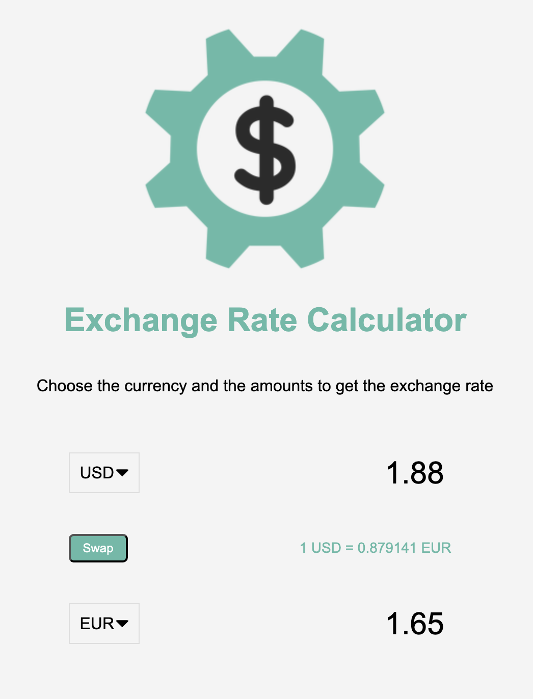

# Exchange Rate Calculator

A simple and interactive exchange rate calculator built with HTML, CSS, and JavaScript. This project allows users to convert between different currencies in real-time using live exchange rates.

Project is deployed at https://exchange-rate-calculator-dun.vercel.app/.

## Features

- **Currency Selection**: Choose from a wide range of currencies for conversion.
- **Real-Time Conversion**: Automatically calculates the converted amount based on the selected currencies and input values.
- **Swap Functionality**: Easily swap the "From" and "To" currencies with a single click.
- **Dynamic Exchange Rate Display**: Shows the current exchange rate between the selected currencies.

## Technologies Used

- HTML
- CSS
- JavaScript
- Exchange rate API (for live data)

## How to Use

- Clone the repository.
- Open `index.html` in your browser.
- Select the currencies and input the amount to see the converted value.
- Use the "Swap" button to quickly switch between the selected currencies.
